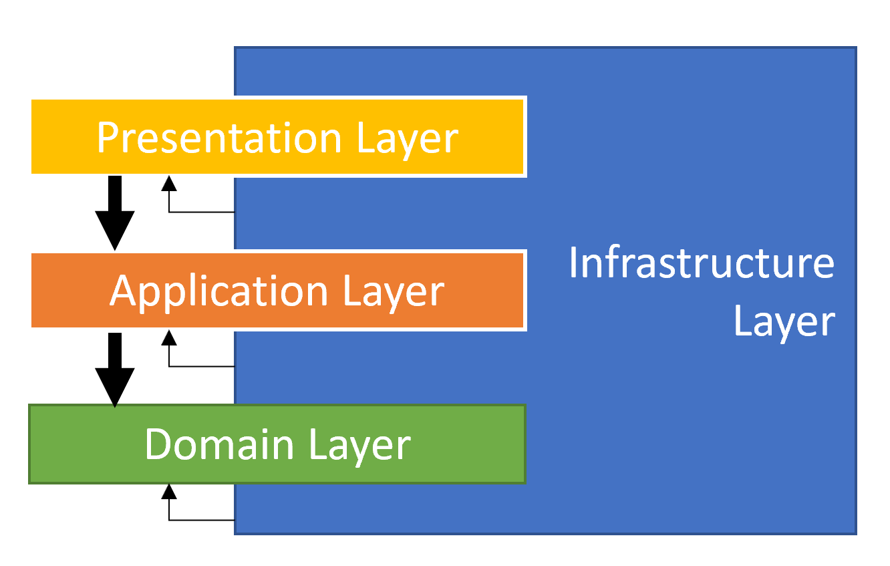
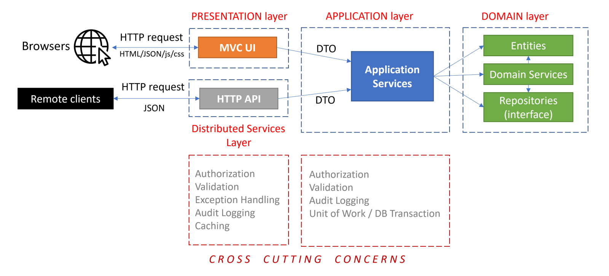

# Domain Driven Development

Думаю, все знают, что такого гексогональная, слоеная (луковичная) архитектура и прочая теория. Все это
агностик-архитектура. Прочитаете в сети. (Потом сюда допишу, если интересно).  
Сейчас же поговорим о компонентном составе DDD и его флоу.

## Слои в DDD



### User Interface (UI) Layer (Presentation Layer): Пользовательский интерфейс

Обеспечивает взаимодействие внешнего мира с нашим приложением. Тут входные данные преобразуются в команды для
приложения.  
Очень часто не выделяется в отдельный слой и сливается со слоем Приложения.

### Application Layer: Слой Приложения

Управляет объектами предметной области, выполняя команды от слоя UI: the Use Cases(Случаи Использования).

Данный слой:

- НЕ содержит бизнес-логику обработки данных.
- Содержит сервисы обработки Объектов из `Domain` слоя (`Application Services`), соответствующие `Use Cases`, которые
  работают с такими объектами из Domain слоя, как Репозитории, Domain-сервисы, Сущности, Value-объекты.
- Нет обращений к Инфраструктуре напрямую. Данный слой ничего не знает о технической реализации внутри
  слоя `Infrastructure`.

### Domain Layer: Предметная область

Содержит всю бизнес-логику обработки данных. Содержит Объекты Предметного Слоя (См. далее).

Данный слой:

- Имеет закрытый контекст выполнения: не обращается к внешнему миру напрямую.
- Не использует объекты вне своего namespace (Нет обращений к другим слоям, ни тем более, за свой контекст выполнения).

### Infrastructure Layer: Инфраструктурный слой

Содержит техническую реализацию деклараций для слоев выше.

Данный слой:

- Не обращается в слой `Application`.
- Не содержит бизнес-логику обработки данных.
- Содержит логику преобразования данных из внешних сервисов для соответствия интерфейсам `Domain`.

## Объекты Domain слоя (из чего он состоит):

- **Context**: Окружение объекта, влияющее на его обработку.
- **Domain**: сфера знаний, к которой относится функциональность программы или подпрограммы.
- **Entity (Сущность)**: объект, имеющий индивидуальные черты: свойства объекта. Уникальность можно выразить через ID.
  Два Entity-объекта с одинаковыми свойствами считаются разными (при условии не одинакового ID (в данном случае - ID -
  не свойство объекта, а идентификатор внешней системы)). Она обычно сопоставима с таблицей в RDBMS. Так же данный
  объект
  имеет свои методы, которые используются бизнес-логикой, для обработки его свойств. Например:

```php
class User {
  public string $firstName;
  public string $lastName;

  public function fullName(): string
  {
    return "$this->lastName $this->firstName";
  }
}
```

Сущность так же может содержать сеттеры и геттеры - методы, присваивающие данные свойствам и получающие их. А так же
иметь функциональный гидратор данных (data hydrator) для автозаполнения свойств, не используя сеттеры (особенно, когда
свойств много).

- **Value Object**: неизменяемый (immutable) тип объекта. Не имеет ID. Два VO с одинаковыми свойствами считаются
  идентичными.  
  Правила:
    - Неизменяемые (immutable). Помогает PHP8 и его `readonly`.
    - Должны содержать всю свою концептуальную форму (т.е. Location без широты - бесполезен).

> *Eric Evans*: Объект, представляющий описательный аспект области без идентичности.

Пример:

  ```php
  class Location {
    public readonly float $long;
    public readonly float $lat;

    public function toArray(): array
    {
      return [$this->long, $this->lat];
    }
  }
  ```

- **Aggregate (Агрегат)** и **AggregateRoot (Корневой Агрегат)**: Это кластер объектов (Entity, VO), которые могут
  рассматриваться как единый объект и связаны с `AggregateRoot`.  
  Корневой агрегат, можно рассматривать как контекст графа данных. Это специфический тип Entity (Имеет ID). Он
  гарантирует согласованность данных и не позволяет внешним системам хранить ссылки на его объекты.
  Например:

```
  - OrderAggregate: AggregateRoot
    - Order: Entity
      - ID: string
      - Amount: VO
      - UserID: string
    - OrderProducts: Collection
      - Product: Entity
        - ID: string
      - Product: Entity
        - ID: string
    - OrderDate: Date
    - TotalItems: Function
    - Place: Entity
    - User: Entity
    - Extra: Entity
    - ...
```

- **Repository Declaration (Интерфейс репозитория)**: Объект, сохраняющий Сущности или Агрегаты в базовый механизм
  хранения или извлекающий их из него.  
  Репозиторий является частью модели предметной области (domain model), поэтому он должен быть независим от поставщика
  базы данных. Вся реализация - в Infrastructure Layer.
  Обычно Репозитории используются для `AggregateRoot` или `Entity`.

> "Mediates between the domain and data mapping layers using a collection-like interface for accessing domain objects" (
> Martin Fowler).

- **Domain Service (Сервисы домена)**: объект, содержащий методы, реализующие core-бизнес-логику домена. Концептуально
  не привязанные к какому-либо объекту (Entity, VO). Не имеет состояния (stateless). Полезно реализовать логику домена,
  которая зависит от типа нескольких агрегированных (сущностей) или некоторых внешних служб.
  Создание таких сервисов необходимо, если вы:
    - Вы реализуете основную логику домена, которая зависит от некоторых служб (например, репозиториев или других
      внешних служб).
    - Логика, которую вам нужно реализовать, связана с более чем одним агрегатом/сущностью, поэтому она неправильно
      вписывается ни в один из агрегатов.
      Как отличить `Application Services` от `Domain Services`, ведь они все реализуют бизнес правила. Вот
      фундаментальные отличия:
    - `Application Services` реализуют Use Cases (Сценарии использования) приложения (взаимодействия пользователей в
      типичном веб-приложении), в то время как `Domain Services` реализуют основную, независимую от Сценариев
      Использования логику домена.
    - `Application Services` получают/возвращают `DTO`, методы `Domain Services` обычно получают и возвращают Объекты
      Домена (Entities, VOs).
    - `Domain services` обычно используются `Application Services` или другими `Domain Services`, в то время,
      как `Application Services` используется самим `Application Layer` (или же `UI Layer`).

### Не Основные Объекты Домена:

- **Specification (Спецификации)**: Спецификация используется для определения именованных, многоразовых и комбинируемых
  фильтров для Entities и других бизнес-объектов. Например, фильтрация выборки или сортировка по БД.
  Когда стоит использовать:
    - Множественное использование в коде (Переиспользование).
    - Композитность: можно соединить несколько спецификаций и получить новую. Это еще один тип переиспользования.
    - Именованность: `LastClientOrderSpecification` лучше объясняет, чем sql-выражение.
    - Тестируемость: Спецификации - отдельные объекты, а значит хорошо тестируемы.
      Когда не нужно использовать: в не связанных с бизнес-логикой выражениях и операциях.
- **Domain Event (Событие Домена)**: это способ информирование другие сервисы в слабо-связанной системе, когда
  происходит определенное событие Домена. Событие может работать через локальный EventBus приложения (Symfony Event Bus)
  или же распределенный (Rabbit, Kafka).

## Объекты Application слоя (из чего он состоит):

- **Application Service**: Это stateless сервисы, которые реализуют `Сценарии Использования (Use Cases)` Приложения.
  Вход и выход данных - через DTO. Данные сервисы используются `UI Layer` или самим `Application Layer` и используются
  для предоставления результата работы Domain-логики в `UI Layer` (через DTO). Они реализуют бизнес-логику `Use Cases`
  через использование `Domain Objects`. Единичный `Use Case` обычно рассматривается, как `Action` или `Unit of Work`.
- **Data Transfer Object (DTO)**: Простые объекты без бизнес-логики, которые используются для передачи данных
  между `UI Layer` и `Application Layer`.
- **Unit of Work (UOW) или Action**: Это атомарная работа, которая должна быть сделана в форме транзакции (не путать с
  БД-транзакциями). Все операции внутри должны быть сделать успешно, иначе, в случае неудачи, все операции внутри -
  нужно
  откатить.

## Другие полезные понятия DDD

### Bounded context

Ограниченный контекст - подсистема в рамках DDD, определяющая контекст применения изолированной части модели. Хорошее
разделение: сильная функциональная связь внутри подсистем и слабая между подсистемами.

### Shared Kernel

Общее ядро - иногда, несмотря на преимущества изолированности, имеет смысл использовать общий код между несколькими
компонентами (чтобы не дублировать его). Компоненты остаются независимыми друг от друга, хотя и используют общее ядро.  
Так один компонент может прослушивать событие, запущенное другим компонентом.

### Subdomain (Поддомен)

- Local subdomain: хорошо изолированная часть предметной области (domain).
- Generic subdomain: общая подобласть, которая не специфична конкретно для приложения, а может использоваться почти в
  любом другом. Например, статистика, метрики, платёжные методы.  
  Общие подобласти лучше не писать, а устанавливать как сторонние пакеты.

## Поток выполнения DDD

На картинке ниже показано, что мы сейчас выучили - как реквест проходит все слои нашего приложения.


- Реквест обычно начинает выполняться из-за пользовательских действий на стороне клиента (через WebUI браузера, или же
  через RestAPI).
- Запрос поступает на контроллер в `UI Layer` (мы не рассматриваем граничные варианты). Далее уже на этом этапе запрос
  может быть отклонен по разным причинам: Auth, Validation, разные Exceptions.  
  В Контроллер внедряется (вспоминаем `DI`) связанный `Application Service` Interface и шлет ему полученные `DTOs`.
- `Application Service`, используя `Domain Objects` (Entities, Repository interfaces, Domain Services, etc.) реализует
  логику `Сценария Использования (Use Case)`. `Application Layer` реализует различные проверки (Authorization,
  Validation, etc.).  
  Метод `Application Service` должен быть `Unit Of Work`. Это подразумевает, что данное действие должно быть атомарно.

## Общие принципы DDD

### Независимость поставщика данных

Слои `Application` и `Domain` должны реализовать схему агностик-data-provider. Они должны быть зависимы только от
интерфейса репозитория.

Причины:

- Независимость от инфрастуктуры. Она может поменяться в будущем.
- Сфокусированность на бизнес-коде, скрыв детали реализации в инфраструктурном слое репозитория (типа, драйвер).
- Тестируемость на высоком уровне. Можно замокать репозиторий.

Пример: Логи хранятся в RDBMS. И мы хотим переехать на ES или CH.

### Независимость технологии, которую используют пользователи

Неважно, изменится ли UI, через которое пользователи получают доступ, `Domain и Application Layers` ничего не должны
знать об этом (о `UI Layer`).  
Неважно, как поступают данные в приложение, `UI Layer` может как меняться, так и расширятся, добавляя новые контексты
выполнения: WebUI, RestAPI, GraphQL, MobileAPI, BFF, Console.

В некоторых случаях, вам может понадобиться дублирование логики в `Application Layer` и `Domain Layer`. Пример:
валидации и авторизация выполняется на обоих слоях. Но проверки на `UI` слое больше направлены на UX, в то время, как
проверки в `Application` слое направлены на безопасность и целостность данных. И это абсолютно нормально и необходимо.

### Сосредоточенность на состояниях объектов DDD, а не на отчетности

DDD сфокусирован на том, как объекты меняются и их взаимодействии. Как создаются сущности и меняются их свойства,
сохраняя целостность данных, реализуя бизнес-правила.

DDD должно игнорировать массовые запросы по аналитике. Всю аналитику нужно отделять в другие сервисы, где для этой
аналитики написаны оптимизированные запросы, проставлены индексы и используется необходимая БД (для целей аналитики). Не
нужно засорять этим бизнес-логику приложения.

## Структура кода

- [PHP](./code-structure-php.md)
